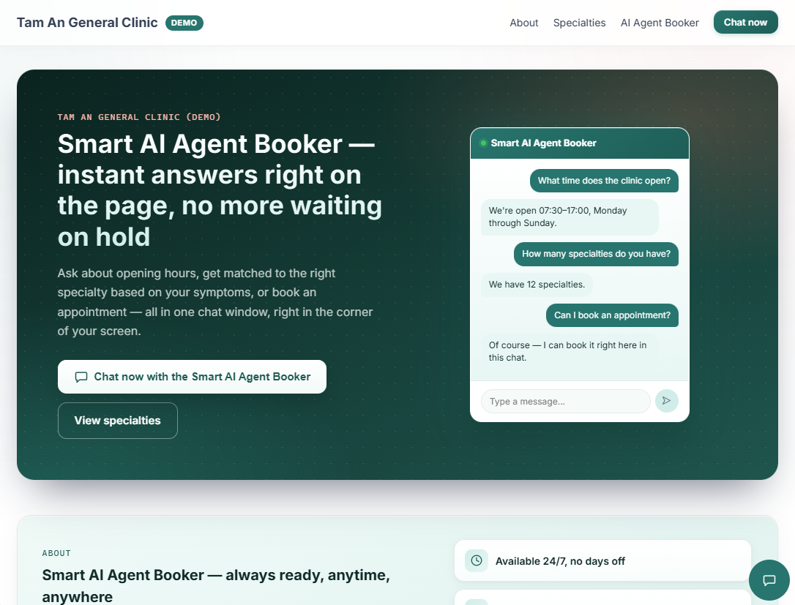

# AI Clinic Booking Agent

[](https://www.python.org/)
[](https://fastapi.tiangolo.com/)
[](https://google.github.io/adk-docs/)
[](https://qdrant.tech/)
[](https://www.postgresql.org/)
[](https://www.apache.org/licenses/LICENSE-2.0)

A multi-agent conversational backend for a clinic booking assistant. Patients talk to it in
natural language — ask about policy/insurance, describe a symptom to get routed to the right
doctor, book/reschedule/cancel an appointment, or trigger emergency screening — while every
write that has to be correct (bookings) is enforced by the database, not by the model's good
behavior.

A portfolio project focused on architecting an AI system the way a non-AI system would be
held to: explicit module boundaries, correctness pushed down to constraints instead of
trusted to LLM output, and — the part most agent demos skip — an **automated evaluation
harness that gates retrieval, routing, and faithfulness quality**, not just uptime. It is
intentionally scoped to the booking-assistant core; see [Out of scope](#out-of-scope) for what
a production deployment would add.

**Stack:** FastAPI · Google ADK (multi-agent) · Gemini · Qdrant · PostgreSQL · APScheduler ·
Alembic · structlog · DeepEval

**🔗 Live demo:** [ai-clinic-booker-demo.vercel.app](https://ai-clinic-booker-demo.vercel.app/)



---

## What this project demonstrates

- **Modular monolith with a multi-agent AI core** — one deployable, five layers separated by
  rate of change and risk (not by what's technically mergeable), with a clear extraction path
  to services later without paying microservice tax up front today.
- **The model never gets the final say on anything transactional** — booking correctness is a
  Postgres constraint, not an instruction the agent is trusted to follow. See
  [Not trusting the LLM](#not-trusting-the-llm-with-anything-that-has-to-be-true).
- **Grounded generation with a designed failure mode** — below a similarity threshold, the
  FAQ/symptom agents say "I don't have that information" instead of generating a
  plausible-sounding answer. Abstaining is a contract, not a hope.
- **Layered safety, not a single confident check** — emergency detection runs as deterministic
  keyword rules *before* the LLM is invoked, and again as an LLM safety net for phrasing the
  rules didn't anticipate.
- **Measured, not asserted** — retrieval, intent routing, booking concurrency, and answer
  faithfulness are CI-shaped gates with fixed thresholds, run against a live stack with real
  Gemini calls. See [Evaluation](#evaluation).

---

## Architecture

Modular monolith — an **AI layer** and a **business layer**, both calling down into a single
**data-access layer**, on a shared config/infra layer. Neither top layer opens a database
connection directly, and neither imports the other.

```
┌─────────────────────────────────────────────────────────────┐
│  app/            FastAPI composition root — ADK runtime,    │
│                  webhook, /api/v1 router                    │
└─────────┬─────────────────────────────────┬─────────────────┘
          │                                 │
┌─────────▼─────────────┐        ┌──────────▼──────────────┐
│  ai_agents/            │        │  modules/                │
│  orchestrator + 4      │        │  admin CRUD +             │
│  domain agents (faq,   │        │  knowledge ingestion      │
│  symptom, booking,     │        │  pipeline (cron-polled)   │
│  emergency)            │        │                           │
└─────────┬──────────────┘        └──────────┬────────────────┘
          │                                  │
          └────────────────┬─────────────────┘
                            ▼
┌───────────────────────────────────────────────────────────────┐
│  dal/   only layer that knows a real table/collection name.   │
│         booking's no-double-booking constraint lives here.    │
├───────────────────────────────────────────────────────────────┤
│  common/  config · logging/tracing · retry/timeout wrappers   │
└───────────────────────────────────────────────────────────────┘
```

Within `ai_agents/`, agents never import each other either — the orchestrator is the only
thing that transfers a session to a domain agent.

### Project layout

```
app/
├── api/v1/           REST routers
├── main.py           app factory
└── runtime.py        ADK runtime wiring

ai_agents/
├── orchestrator/     intent routing
├── faq/              agent.py · tools.py · prompt.py
├── symptom/          agent.py · tools.py · prompt.py
├── booking/          agent.py · tools.py · prompt.py
├── emergency/        agent.py · tools.py · prompt.py
└── core/             base agent/tool, domain rules

modules/
├── booking/          admin CRUD
├── doctor/           admin CRUD
├── knowledge/        admin CRUD
├── conversation/     chat controller
└── knowledge_ingestion/   chunk_service · embedding_service · cron.py

core/       base_model · base_repository · base_service · exceptions
dal/        booking_repository · doctor_repository · knowledge_repository ·
            chunk_repository · ingestion_job_repository · qdrant_client
common/     config · database · gemini_client · observability · resilience
eval/       golden_set_*.yaml · deepeval_dataset.py · metrics.py · runner.py ·
            REPORT.md · DEEPEVAL_REPORT.md
docs/       01-architecture.md
tests/      unit/ · integration/ · eval/
alembic/    versions/
```

**Key design choices**

| Choice | Why |
|---|---|
| No Port/Adapter abstraction per datastore provider | Stack is already fixed (ADK + Postgres + Qdrant); `dal/` alone already buys "swap the implementation in one place" without a speculative interface nothing else will implement. |
| Booking correctness = DB constraint, not app-level lock | A partial `UNIQUE(doctor_id, slot_time) WHERE status != 'cancelled'` is correct on *every* write, independent of what any agent believed a moment earlier. Partial, not plain unique, because cancelling only flips `status` — a plain unique index would permanently block rebooking a cancelled slot. |
| Doctor roster rendered into context, not retrieved via Qdrant | A clinic has a few dozen doctors — small enough to put the entire roster in the symptom agent's prompt. Trades a slightly larger prompt for zero retrieval-miss risk on "which of your doctors handles X," which top-K search quietly gets wrong. |
| Two-layer emergency detection | Layer 1: deterministic keyword rules, no LLM round-trip, catches the common case instantly. Layer 2: the orchestrator LLM still screens for indirect phrasing the rule list didn't anticipate. A false positive costs an unnecessary message; a false negative costs a real emergency going to a FAQ answer. |
| Knowledge ingestion is a 2-phase, cron-polled pipeline, not synchronous on publish | Publishing returns immediately; a worker claims jobs with `SKIP LOCKED`, idempotent — safe to retry, safe to scale to multiple instances. Same `run(job_id)` contract is also invoked directly for immediate re-index/retry — no separate code path for "manual" vs. "automatic." |
| RAG grounding mandatory, threshold-gated abstention | Similarity below threshold → "no information found," not a generated guess. Wrong medical/policy info is a liability, not a feature. |

Full design doc: [`docs/01-architecture.md`](docs/01-architecture.md) — decision log with rationale in [§11](docs/01-architecture.md#decision-log).

### Not trusting the LLM with anything that has to be true

```
check_available_slots()  →  agent proposes a time  →  create_booking()
                                                              │
                                     INSERT competes against a partial
                                     UNIQUE(doctor_id, slot_time)
                                     WHERE status != 'cancelled'
                                              │
                              second writer's INSERT fails at the DB,
                              agent catches SlotTakenError and re-proposes
```

`check_available_slots` and `create_booking` are two separate calls — there's a real race
window between them. The system doesn't try to close that race with application-level
locking; the database's constraint is the final word every time, regardless of what any agent
believed a moment earlier.

Emergency handling applies the same instinct in a different shape — two independent checks
instead of one confident one:

```
message → keyword rules (no LLM, Layer 1) → match → static emergency response
              │
              no match
              ▼
         orchestrator LLM classifies intent → still screens for
         indirect emergency phrasing (Layer 2, safety net)
              │
              no match at either layer → normal FAQ/symptom/booking flow
```

---

## Evaluation

Unit tests catch it if a function returns the wrong type. They don't catch it if the FAQ
agent starts fabricating clinic policy, or if a prompt change quietly drops intent-routing
accuracy from 95% to 80%. That needs its own gate, run against the live stack with real
Gemini calls (`pytest -m eval`) — no mocks, because the thing being measured *is* the model's
behavior.

Numbers below are as of 2026-07-14 (full docker rebuild, clean-data reseed, live re-run), all
green. The eval suite regenerates them on every run — [`eval/REPORT.md`](eval/REPORT.md) is the
auto-generated, always-current source of truth; if the two ever disagree, trust the report, not
this table.

| Metric | What it catches | Threshold | Current |
|---|---|---|---|
| Span Hit Rate@5 | The verbatim source chunk isn't in the top 5 retrieved | ≥ 0.80 | ✅ 1.000 |
| Span MRR | The source chunk is retrieved but ranked poorly | ≥ 0.60 | ✅ 0.812 |
| Context Precision@5¹ | Retrieved chunks are mostly noise, not signal | ≥ 0.20 | ✅ 0.233 |
| Hit Rate@5 (doc-id) | Relevant knowledge doc isn't in the top 5 retrieved | ≥ 0.70 | ✅ 1.000 |
| MRR (doc-id) | Relevant doc retrieved but ranked poorly | ≥ 0.90 | ✅ 0.970 |
| Keyword Match | The real generated answer misses expected facts | ≥ 0.70 | ✅ 0.796 |
| Faithfulness (LLM-judge) | The real generated answer isn't grounded in retrieved context | ≥ 0.75 | ✅ 0.856 |
| Intent Routing Accuracy | Orchestrator sends the conversation to the wrong domain agent | ≥ 0.80 | ✅ 1.000 |
| Booking Concurrency Pass Rate | Two concurrent bookings on the same slot both commit (double-booking) | = 1.00 | ✅ 1.000 |
| DeepEval judge suite (15 cases) | Answer relevancy / faithfulness / GEval on FAQ, symptom, booking flows | pass/fail per case | ⚠️ 12/15 clean, 3 persona trade-off |

¹ `Context Precision@5`'s threshold (`≥ 0.20`) sits close to its current value (`0.233`) by
design, not because it was tuned to just barely pass: retrieval intentionally casts a wide
top-K net (`TOP_K = 6`) to protect recall (missing the right chunk is far more costly than
including an extra one), which structurally caps how high precision can go. 0.20 is the floor
below which retrieved context is mostly noise; it isn't meant to track close to 1.0 the way the
hit-rate/MRR metrics are.

The two previously-❌ generation-quality rows (Keyword Match, Faithfulness) are now fixed and
green — going through the real conversation API for generation (not just measuring retrieval in
isolation) originally surfaced two product-behavior findings (an Orchestrator routing ambiguity
and a category mismatch), both root-caused, fixed, and re-confirmed passing — see
[`eval/EVAL_FINDINGS.md` §6](eval/EVAL_FINDINGS.md).

**A note on what "real conversation API" covers.** The claim above is true, but not uniform
across every row — there are 3 distinct coverage levels in this eval suite, and conflating them
would overstate how end-to-end some of it is:
- **Retrieval, RAG generation, intent routing** — full HTTP round-trip through the real
  `/api/v1/agents/booker/conversations/{conversation_id}/messages` endpoint, real Gemini calls,
  real Qdrant/Postgres.
- **DeepEval judge suite (15 cases)** — real runtime/LLM/DB/Qdrant, but in-process: built via
  `build_runtime()` and driven through `runner.run_async()` (see
  `tests/eval/conftest.py::run_conversation`), skipping the HTTP layer and
  `modules/conversation/controller.py`'s routing/validation.
- **Booking Concurrency Pass Rate** — also in-process, but one level deeper: it calls
  `BookingRepository.create_booking` directly, with no LLM in the loop at all. There's no REST
  endpoint for creating a booking to hit here — the only real path is a two-turn, LLM-driven
  conversation, which isn't deterministic enough to pin down a race condition. Going straight to
  the repository is the deliberate choice that makes the race reproducible.

The DeepEval row is intentionally not a clean fraction. Of 15 cases: 12 pass with no concerns; the
remaining 3 all dip below the Answer Relevancy threshold on the FAQ suite (two pricing questions,
one specialties-overview question) purely from a friendlier conversational persona folding in
extra context the user didn't strictly ask for — the underlying facts stay grounded (Faithfulness
is 1.000 on all three). No fabrication, routing, or booking-concurrency case fails: the
symptom-triage doctor-specialty fabrication and the booking name→id resolution gaps flagged in
earlier rounds are confirmed fixed and have not regressed. Nothing here is hidden or
threshold-adjusted away; full history and reasoning are in
[`eval/EVAL_FINDINGS.md` §7-§8](eval/EVAL_FINDINGS.md) and [`eval/DEEPEVAL_REPORT.md`](eval/DEEPEVAL_REPORT.md).

`scripts/seed_eval_fixtures.py` wipes and reseeds fixed fixture data before a run, so results
are comparable across runs instead of drifting with leftover state. Full methodology and the
one interesting LLM-judge false negative I dug into (traced to the judge quoting a sentence
that never appeared in the agent's actual output) are in
[`eval/REPORT.md`](eval/REPORT.md) and [`eval/EVAL_FINDINGS.md`](eval/EVAL_FINDINGS.md). DeepEval
case data lives in `eval/golden_set_deepeval_{faq,symptom,booking}.yaml`, loaded via
`deepeval.dataset.EvaluationDataset` (`eval/deepeval_dataset.py`) — the same "data in YAML, code
just loads + iterates" convention the other 3 golden sets already use.

That gate also caught a real production bug, not manual testing: the agents' ADK-internal
Gemini client bypassed the app's retry wrapper (it uses google-adk's own client, not
`common/gemini_client.py`), so a single transient 503 from Google could fail an entire eval
run and look like a routing regression. Fixed with the library's own native retry mechanism
and covered by a unit test that simulates the failure
(`tests/unit/ai_agents/test_adk_model_retry.py`).

---

## Quick Start

```bash
python -m venv .venv
.venv/Scripts/activate       # Windows
# source .venv/bin/activate  # macOS/Linux

pip install -e ".[dev]"
cp .env.example .env          # add GEMINI_API_KEY, set a real POSTGRES_PASSWORD
```

```bash
docker compose up -d          # Postgres + Qdrant + app; app runs migrations on boot
python scripts/smoke_test.py  # one message per intent against the running stack
```

**Per-language 3-server local test (ADR-0023, `app-vn`/`app-jp`/`app-en`)** — these are gated
behind the `multi-lang` compose profile, so they never start from a bare `docker compose up`.
On a fresh/empty DB, the first run **must** migrate sequentially before starting the servers —
running them concurrently on an empty DB races the idempotent-guard migrations:

```bash
# First time only, on an empty DB — one at a time, wait for each to exit:
docker compose run --rm --no-deps app-vn alembic upgrade head
docker compose run --rm --no-deps app-jp alembic upgrade head
docker compose run --rm --no-deps app-en alembic upgrade head

# Only after all three above have finished:
docker compose --profile multi-lang up -d app-vn app-jp app-en
```

---

## API Reference

| Method | Endpoint | Description |
|---|---|---|
| POST | `/api/v1/agents/booker/conversations/{conversation_id}/messages` | Send a message to the booking agent, get the agent's reply |
| GET | `/api/v1/doctors` | List doctors |
| GET | `/api/v1/doctors/{doctor_id}` | Doctor details |
| POST | `/api/v1/doctors` | Create doctor |
| PATCH | `/api/v1/doctors/{doctor_id}` | Update doctor |
| POST | `/api/v1/doctors/{doctor_id}/deactivate` | Deactivate doctor |
| GET | `/api/v1/bookings` | List bookings (admin) |
| POST | `/api/v1/bookings/{booking_id}/cancel` | Cancel a booking |
| POST | `/api/v1/bookings/{booking_id}/reschedule` | Reschedule a booking |
| POST | `/api/v1/knowledge` | Create a knowledge entry (draft) |
| GET | `/api/v1/knowledge` | List knowledge entries |
| PATCH | `/api/v1/knowledge/{knowledge_id}` | Update a knowledge entry |
| POST | `/api/v1/knowledge/{knowledge_id}/publish` | Publish — triggers chunk + embed pipeline |
| DELETE | `/api/v1/knowledge/{knowledge_id}` | Delete + remove its vectors from Qdrant |
| GET | `/health` | Liveness |

Interactive docs: `http://localhost:8000/docs`

---

## Development

```bash
pytest                        # offline-safe unit tests
python scripts/seed_eval_fixtures.py   # reset to known-clean state before an eval run
pytest -m eval                 # real AI quality gate — needs the live stack + GEMINI_API_KEY
ruff check .
```

---

## Configuration

All settings are Pydantic `Settings` loaded from `.env` (`common/config.py`). Full list with
defaults in `.env.example`; the ones worth knowing about:

| Variable | Default | Description |
|---|---|---|
| `GEMINI_API_KEY` | *(required)* | Gemini API key |
| `{ORCHESTRATOR,BOOKING,SYMPTOM,FAQ,EMERGENCY}_LLM_MODEL` | `gemini-2.5-flash` | Each agent's model is independently configurable, not shared/hardcoded |
| `GEMINI_EMBEDDING_MODEL` | `gemini-embedding-001` | Embedding model for RAG |
| `SIMILARITY_THRESHOLD` | `0.7` | RAG grounding cutoff — below this, agents abstain instead of answering |
| `TOP_K` | `6` | Chunks retrieved per query |
| `POSTGRES_*` | — | Composed into `database_url` |
| `QDRANT_HOST` / `QDRANT_PORT` / `QDRANT_COLLECTION` | — | Composed into `qdrant_url` |
| `EMBEDDING_BATCH_SIZE` | `100` | Chunks per embedding batch during ingestion |

---

## Out of scope

Deliberately scoped to the booking-assistant core (agents, grounded RAG, transactional
booking, evaluation). A production deployment would add — and these are intentionally **not**
built here:

- **AuthN / AuthZ** — no authentication, RBAC, or per-tenant isolation. Every endpoint is open.
- **Rate limiting & quotas** — no abuse protection on the conversation or admin endpoints.
- **Secret management** — keys come from `.env`; production would use a vault/secret manager.
- **Long-term cross-session memory** — ADK's `MemoryService` would let an agent recognize a
  returning patient weeks later; not built because there's no real requirement for it yet, and
  a half-implementation would be worse than none.
- **Admin/audit** — no audit log, no PII redaction for clinical data in transcripts.

Calling these out explicitly is the point: the layering leaves clean seams for them
(middleware in `app/`, policy in `core/`), but they are not implemented.

**Not a medical device.** This is a portfolio/demo project. The emergency-detection layer
(see [Not trusting the LLM](#not-trusting-the-llm-with-anything-that-has-to-be-true)) is an
architecture pattern for AI safety-net design, not a certified or validated clinical triage
system — it is not intended for, and must not be used for, real patient care or emergency
medical decisions.

## Roadmap

- Exercise the ADK retry fix against a real transient 503 in a live eval run — currently
  proven only by a unit test that simulates the failure, not by an observed live occurrence.
- `MemoryService`-backed long-term memory, if a real multi-visit personalization need shows up.

---

## About

Built by **Dang NT** — a software engineer working across system architecture, fullstack
development, and AI applications. I design systems end to end: drawing the module boundaries,
writing the code, and — as this project shows — proving the result with measurement rather
than assertion.

This repository is a portfolio piece. Every non-trivial architecture decision is recorded
with its rationale in the [decision log](docs/01-architecture.md#decision-log),
every quality claim is backed by the [evaluation harness](#evaluation), and every shortcut is
named in [Out of scope](#out-of-scope).

- LinkedIn: [linkedin.com/in/dangnt](https://www.linkedin.com/in/dangnt/)
- Email: [dangnt.vn@gmail.com](mailto:dangnt.vn@gmail.com)
